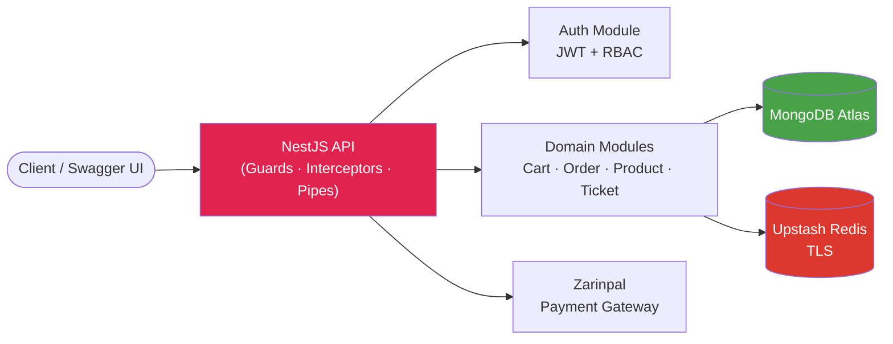

<div align="center">

# 🛒 E-Commerce Backend Platform

**A production-grade, modular e-commerce API built with NestJS — from architecture to deployment.**

[](https://nestjs.com/)
[](https://www.typescriptlang.org/)
[](https://www.mongodb.com/)
[](https://redis.io/)
[](https://www.docker.com/)
[](https://render.com/)

[Live API Docs](https://e-commerce-2r9t.onrender.com/api) · [Report Bug](https://github.com/AbolfazlMnf/E-Commerce/issues) · [Request Feature](https://github.com/AbolfazlMnf/E-Commerce/issues)

</div>

---

## Why this project exists

Most portfolio e-commerce projects stop at CRUD. This one doesn't. It's built the way a real backend team would build it: **modular domain boundaries, defense-in-depth security, a data layer that survives container restarts, and a deployment pipeline that ships on every push.** Every architectural decision below was made deliberately — and I can defend it.

## Table of Contents

- [Features](#features)
- [Architecture](#architecture)
- [Tech Stack](#tech-stack)
- [Security](#security)
- [Getting Started](#getting-started)
- [Environment Variables](#environment-variables)
- [API Documentation](#api-documentation)
- [Deployment](#deployment)
- [Project Structure](#project-structure)
- [Roadmap](#roadmap)

---

## Features

**Commerce Core**

- Full product catalog with search, filtering, sorting, and pagination
- Persistent shopping cart tied to authenticated users
- Order lifecycle management with status tracking and order history
- Zarinpal payment gateway integration (sandbox) with callback verification

**Identity & Access**

- JWT-based authentication with refresh flow
- Role-based access control (RBAC) — isolated Admin and User dashboards
- API key protection layer for internal/admin-only routes

**Platform**

- 9+ feature modules, 50+ RESTful endpoints
- Image upload pipeline via Multer
- Interactive, always-up-to-date Swagger/OpenAPI documentation
- Ticketing and comment systems for customer support and product feedback

## Architecture

The application follows NestJS's modular architecture — each domain (Auth, Cart, Order, Product, Ticket, Comment, Shipping...) is a self-contained module with its own controller, service, schema, and DTOs, communicating through well-defined providers rather than reaching across boundaries.



**A deliberate choice worth calling out:** the API container itself is stateless. MongoDB and Redis both live in managed cloud services (Atlas / Upstash), not inside the container's filesystem — which means redeploys, restarts, and scaling events never risk data loss. This is the same pattern used in production PaaS deployments (Render, Railway, Fly.io).

## Tech Stack

| Layer                     | Technology                                           |
| ------------------------- | ---------------------------------------------------- |
| **Runtime & Framework**   | Node.js, NestJS, TypeScript                          |
| **Database**              | MongoDB (Mongoose ODM) — MongoDB Atlas in production |
| **Cache / Session Store** | Redis (ioredis) — Upstash with TLS in production     |
| **Auth**                  | JWT, bcrypt, custom Guards & RBAC                    |
| **Payments**              | Zarinpal Payment Gateway (Sandbox)                   |
| **Docs**                  | Swagger / OpenAPI                                    |
| **Containerization**      | Docker (multi-stage build), Docker Compose           |
| **Hosting**               | Render (Git-triggered auto-deploy)                   |

## Security

Security isn't bolted on — it's layered through the request lifecycle:

| Layer               | Implementation                                                                   |
| ------------------- | -------------------------------------------------------------------------------- |
| Transport hardening | `Helmet` — sensible security headers by default                                  |
| Rate limiting       | `Throttler` — brute-force and abuse mitigation                                   |
| Payload integrity   | `class-validator` DTOs on every incoming request                                 |
| Password storage    | `bcrypt` hashing, never plaintext                                                |
| Response size       | `Compression` middleware                                                         |
| Access control      | Custom `Guards` enforcing JWT + role checks per route                            |
| Internal routes     | API key validation via custom `Middleware`                                       |
| Runtime isolation   | Docker container runs as a **non-root user**                                     |
| Secrets             | Injected via environment variables — never committed, never baked into the image |

## Getting Started

### Prerequisites

- Node.js 22+
- Docker & Docker Compose
- A MongoDB connection string and Redis instance (local via Compose, or cloud)

### Run locally with Docker Compose

```bash
git clone https://github.com/AbolfazlMnf/E-Commerce.git
cd E-Commerce
cp .env.example .env    # fill in your own values
docker compose up --build
```

The API will be available at `http://localhost:3000`, with Swagger docs at `http://localhost:3000/api`.

### Run without Docker

```bash
npm install
npm run start:dev
```

## Environment Variables

| Variable                                         | Description                                          |
| ------------------------------------------------ | ---------------------------------------------------- |
| `DB_URL`                                         | MongoDB connection string                            |
| `REDIS_HOST` / `REDIS_PORT` / `REDIS_PASSWORD`   | Redis connection details (TLS-enabled in production) |
| `JWT_SECRET`                                     | Secret used to sign access tokens                    |
| `API_KEY`                                        | Shared key for protected internal routes             |
| `MERCHANT_ID`                                    | Zarinpal merchant identifier                         |
| `BANK_URL` / `BANK_VERIFY_URL` / `CALL_BACK_URL` | Zarinpal payment request/verify/callback endpoints   |
| `SITE_URL`                                       | Public base URL of the deployed API                  |

See `.env.example` for the full list with placeholder values.

## API Documentation

Full interactive API documentation is available via Swagger:

**[→ e-commerce-2r9t.onrender.com/api](https://e-commerce-2r9t.onrender.com/api)**

> ⚠️ Hosted on Render's free tier — the first request after a period of inactivity may take 30–60s to wake the service.

## Deployment

This project ships through a real containerized pipeline, not a one-off script:

1. **Build** — Multi-stage `Dockerfile` compiles TypeScript and prunes dev dependencies, producing a lean, non-root production image.
2. **Orchestrate (local)** — `docker-compose.yml` wires the API to MongoDB and Redis with health checks, restart policies, and named volumes so local state survives container restarts.
3. **Ship (production)** — MongoDB and Redis are decoupled into managed cloud services; the API container is deployed to Render, which rebuilds and redeploys automatically on every push to `main` — with zero downtime and automatic rollback if a build fails.

## Project Structure

```
src/
├── auth/            # JWT strategy, guards, RBAC
├── users/            # User accounts & profiles
├── product/          # Catalog: search, filter, sort, pagination
├── cart/              # Persistent shopping cart
├── order/            # Order lifecycle & Zarinpal integration
├── panel-ticket/     # Admin/user support tickets
├── comment/           # Product & site comments
├── shipping/          # Admin shipping configuration
├── general/image/     # Multer-based image upload pipeline
├── common/            # Shared Pipes, Interceptors, Filters, Decorators
└── main.ts
```

## Roadmap

- [ ] Automated test suite (Jest — unit + e2e)
- [ ] CI pipeline (lint + test) gating deploys
- [ ] Object storage (Cloudflare R2 / S3) for uploaded images
- [ ] Webhook-based order status notifications

---

<div align="center">

Built by **[Abolfazl Momenifar](https://github.com/AbolfazlMnf)** — Full-Stack TypeScript Developer

</div>
